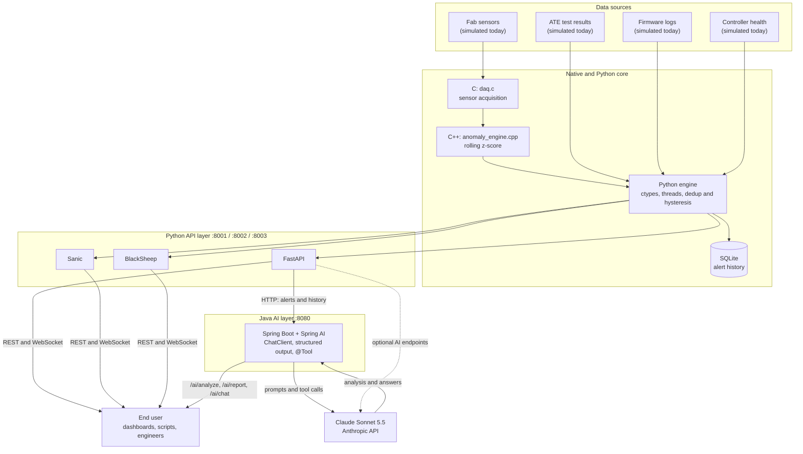

# Semiconductor Real-Time Issue Monitor

## About the Application Stack

### Technology stack

| Layer | Technology | Role |
|---|---|---|
| Data acquisition | **C** (`gcc`, `c_src/daq.c`) | Fast raw sensor sampling: temperature, chamber pressure, vibration, supply voltage |
| Anomaly detection | **C++17** (`g++`, `cpp_src/anomaly_engine.cpp`) | Rolling-window statistics (mean, standard deviation, z-score) per sensor channel |
| Orchestration | **Python 3** (`ctypes`, `threading`) | Loads the C/C++ shared libraries, runs the FAB / ATE / FIRMWARE / HEALTH monitors, de-duplicates alerts |
| Persistence | **SQLite** | Alert history that survives restarts |
| REST + WebSocket APIs | **FastAPI** (Uvicorn), **Sanic**, **BlackSheep** | Three interchangeable backends exposing the same API |
| AI service | **Java 17, Spring Boot 3.5, Spring AI 1.1** | Typed AI endpoints and tool-calling chat |
| LLM provider | **Anthropic API** | Hosts the Claude model |

### AI and analytics models

| Model | Type | Where it runs | What it does |
|---|---|---|---|
| **Claude Sonnet 5.5** (`claude-sonnet-5-5`) | Large language model (Anthropic) | Python backend (`backend/core/ai_insights.py`) and Spring AI service (`spring_ai_service/`) | Root-cause hypotheses for alert bursts, shift-handoff reports, and a chat assistant that calls read-only tools to query live alerts |
| **Rolling-window z-score** | Statistical model (SPC-style, not machine learning) | C++ engine | Flags sensor readings that drift beyond the warning (3σ) or critical (5σ) limits of the recent window |
| **Regex signature matching** | Rule-based | Python | Detects `ERROR`, `PANIC`, `WDT_RESET` and `NULL_PTR` patterns in firmware logs |
| **Deduplication with hysteresis** | Rule-based | Python | Alerts on entry and escalation, then again after a cooldown, and emits a RESOLVED alert on recovery |

The Claude model name is configurable with the `ANTHROPIC_MODEL` environment variable. The API key is supplied through `ANTHROPIC_API_KEY=****` and is never stored in the code or in this repository.

### Architecture

Data flows from the sources through the C and C++ modules into the Python engine, which stores alerts in SQLite and publishes them over REST and WebSocket. The Spring AI service reads those alerts over HTTP and asks Claude to analyze them.

## What Is This Application All About

This application is a real-time issue-detection platform for a semiconductor fab and test floor. It watches four sources at once and merges them into one live, severity-ranked alert stream:

1. **FAB**: process sensor readings, flagged when they drift outside their statistically normal range.
2. **ATE**: die-level test failures (functional scan, leakage current, parametric, timing, burn-in).
3. **FIRMWARE**: embedded device logs, scanned for crash, watchdog and error signatures.
4. **HEALTH**: CPU, memory and disk usage of the tool controller.

Alerts are de-duplicated, stored in a database, pushed live over WebSocket, and can be handed to Claude for root-cause analysis, shift-handoff reports and natural-language questions such as "Are there critical FAB alerts right now, and what could cause them?"

The sensor, ATE, firmware and health inputs are currently simulated. The interfaces are designed so they can be replaced with real equipment feeds (SPI/I2C, DAQ cards, SECS/GEM, test logs, syslog).

## Why This Application Is Different

- **One view across the whole floor.** Many tools cover one domain only (process data, test data or device logs). This one correlates FAB, ATE, FIRMWARE and HEALTH events in a single timeline.
- **Native-speed detection.** Acquisition and statistics run in C and C++, while Python only orchestrates, so the hot path stays fast.
- **Explainable detection, AI-assisted triage.** Alerts come from transparent statistics (a z-score you can audit), and Claude is used afterwards to interpret them rather than to decide what is an anomaly.
- **Alert-flood protection.** Deduplication, escalation-only re-alerting, cooldowns and RESOLVED notices mean a stuck sensor produces one alert, not thousands.
- **Typed, tool-using AI.** The Spring AI service returns structured objects (not free text), and Claude can fetch live data itself through read-only tools. The tools cannot change anything in the system.
- **Untrusted-data safeguards.** Log and alert text is treated as data, never as instructions, when it is sent to the model.
- **Framework choice.** The same API is available on FastAPI, Sanic and BlackSheep, so teams can compare them or choose the one that fits their environment.

## Why the End User Needs This Application

- **Faster detection.** Engineers see problems within about a second of the reading, instead of finding them in a log review or at end-of-lot yield.
- **Less noise, less fatigue.** Deduplicated, severity-ranked alerts keep attention on the issues that matter.
- **Quicker root cause.** Instead of manually cross-checking sensor, test and firmware logs, the user asks for a hypothesis and a concrete next diagnostic step.
- **Smoother shift handoffs.** A generated report summarizes status, incidents by subsystem and follow-ups for the next engineer.
- **Plain-language access.** Anyone on the team can ask questions in ordinary language and get answers based on live and historical alerts.
- **Traceable history.** Every alert is stored, so incidents can be reviewed and audited after a restart or weeks later.
- **Adaptable.** The simulated inputs can be swapped for real equipment interfaces, and thresholds, channels and notifications can be extended without redesigning the system.

*Sensitive values such as API keys and credentials are never shown in documentation or logs and appear only as `****`.*
